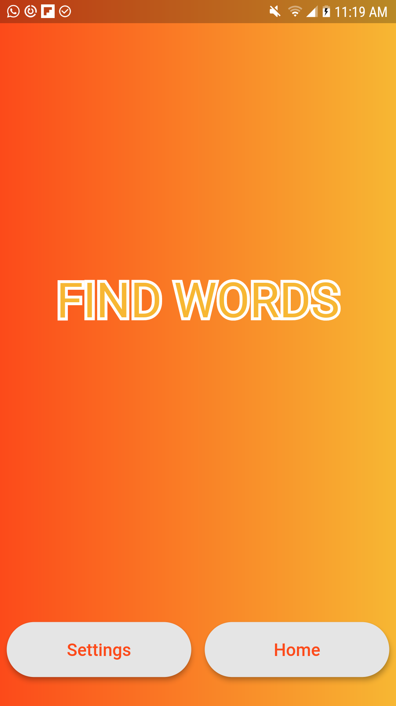
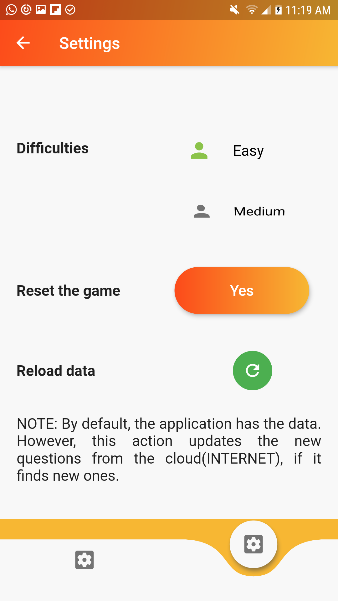
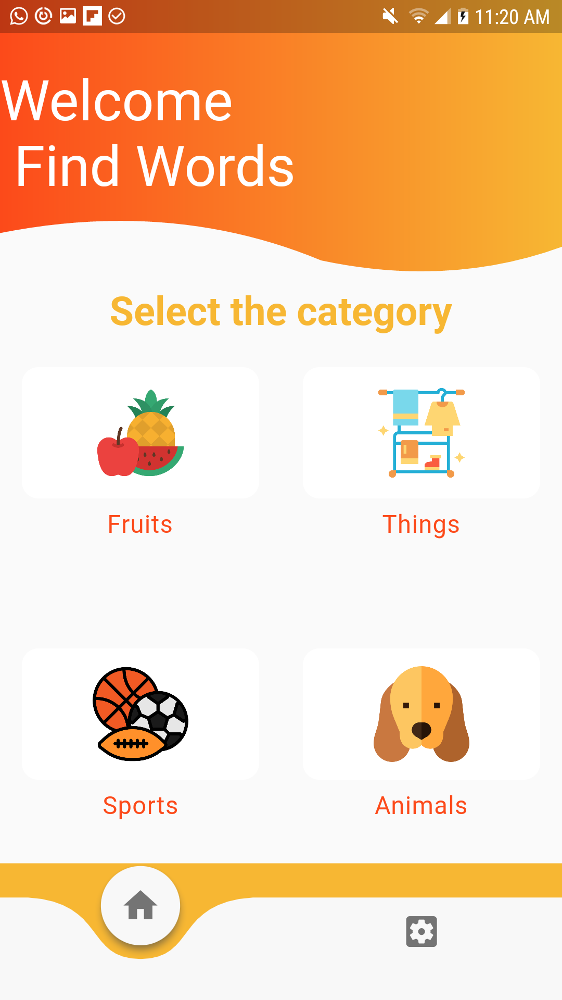
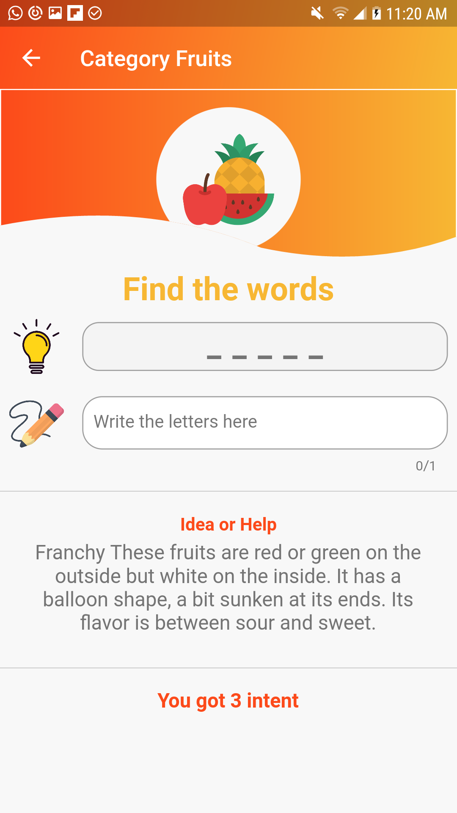
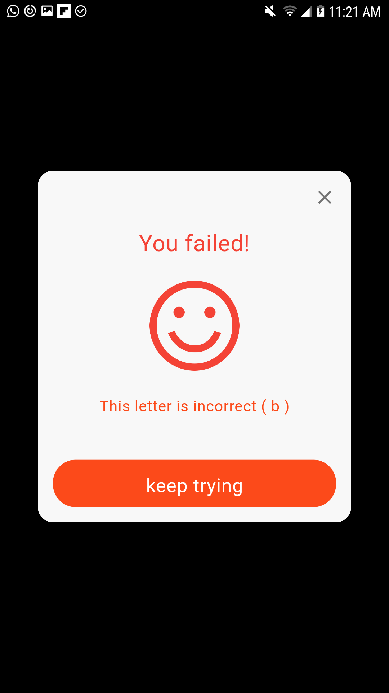

# Smart Words (Find Words) App

[Smart Words App - see in Google Play](https://play.google.com/store/apps/details?id=com.fjr.findwords)

This app will help you speed up your mind and learn new things.

This app allows you to find words and letters to win the battle.
The application supports the Spanish and English language.
You will have categories to choose from, such as fruits, human body, things, sports and animals.

In addition, in the settings option you can change the difficulty of the game (easy, medium and hard), reset the game and reload data from the cloud.

### Flutter libraries used in this project
* flutter_localizations
* sembast
* flutter_bloc
* bloc
* shared_preferences
* cloud_firestore
* path_provider
* intl
* intl_translation
* firebase_core
* modal_progress_hud
* firebase_admob
* assets_audio_player
* rflutter_alert

### Prerequisites
* Follow this step by step for installing Flutter: - [Installing Flutter](https://flutter.dev/docs/get-started/install)

## Getting the code

1- Clone repository

```
git clone https://github.com/franchyreyes/flutter-smart-words-app.git
```

## Screen








## License

[Flutter license](https://github.com/flutter/flutter/blob/master/LICENSE)

Note: This code has only been tested in the Android environment

Any question feel free to contact me at franchyreyes@hotmail.com


